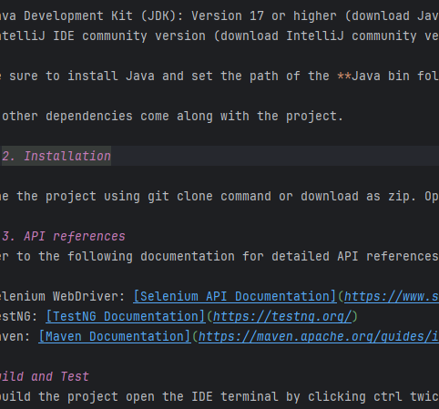

# Introduction
The UI-E2E-Testing repository provides a robust framework for automating end-to-end testing of the ITM Platform using Selenium WebDriver and Java.
The goal is to minimize manual testing efforts by automating various test scenarios, including smoke tests, functional tests, and regression tests for bug fixes.

# Getting Started
### 1. Software dependencies

- Java Development Kit (JDK): Version 17 or higher (download Java installer from here - [Link for Java Installer](https://www.oracle.com/in/java/technologies/downloads/))
- IntelliJ IDE community version (download IntelliJ community version from here - [Link for IntelliJ community edition](https://www.jetbrains.com/idea/download/?section=windows))

Make sure to install Java and set the path of the **Java bin folder** in the **path** system environment variable. Must have IntelliJ IDE to execute the tests.

The other dependencies come along with the project.

### 2. Installation

Clone the project using git clone command or download as zip. Open in IntelliJ and you are all set to proceed.

### 3. API references
Refer to the following documentation for detailed API references:

- Selenium WebDriver: [Selenium API Documentation](https://www.selenium.dev/documentation/)
- TestNG: [TestNG Documentation](https://testng.org/)
- Maven: [Maven Documentation](https://maven.apache.org/guides/index.html)

# Build and Test
To build the project open the IDE terminal by clicking ctrl twice and run **mvn clean install** command. This would compile, test & package the project and install/copy the built .jar/.war file from the pom.xml file into your local maven repository.

To run the tests right-click the TestRunner/TestSuite.xml file and select **Run** to start the test execution. The TestRunner has multiple runner files based on the type of test cases. To execute particular test case groups use the specific runner file and to execute all the test cases use TestSuite.xml file. The tests report result is generated in the target/Extent-Reports folder.

To run tests on stage or production choose the desired URL from the src/test/java/Utils/EnvironmentVariables.properties file and use that URL in **driver.navigate().to()** command in the **setupBrowserAndNavigateToWebApp()** method in src/test/java/Utils/Config/Utils.Config.BaseClass file.

# Contribute

- Submit bugs and feature requests, and help us verify as they are checked in
- Review source code changes
