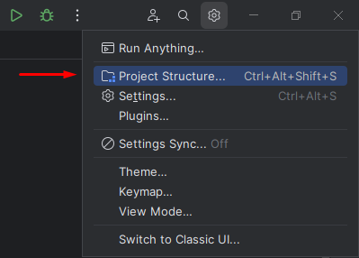
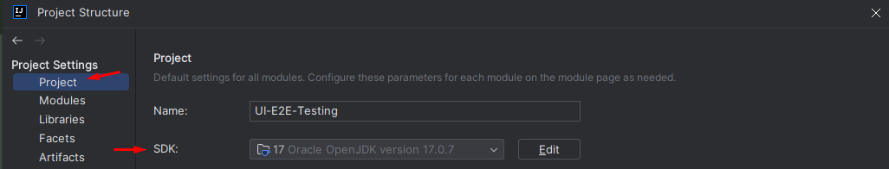
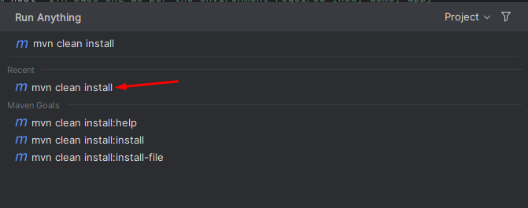
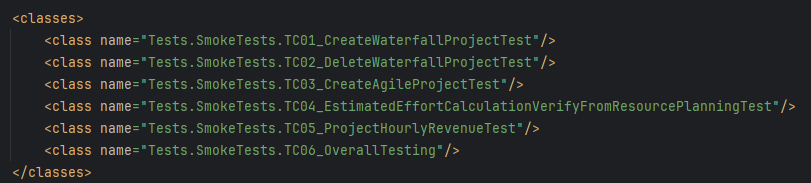
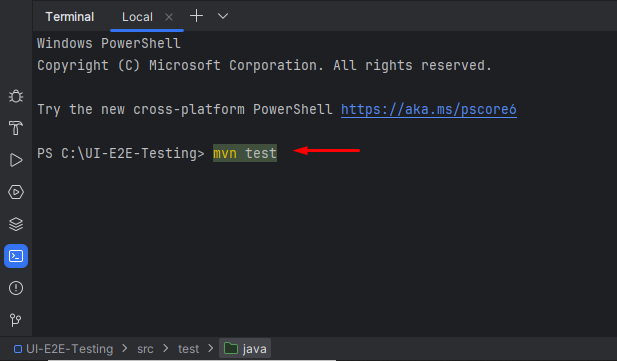
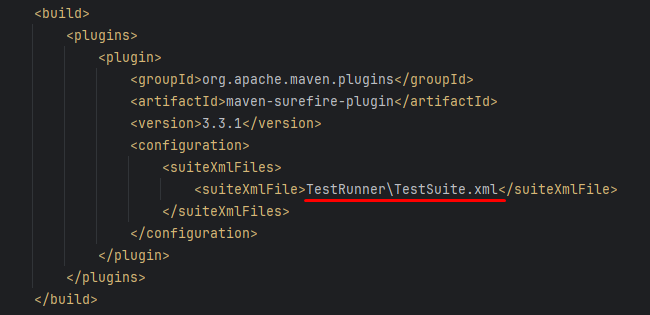
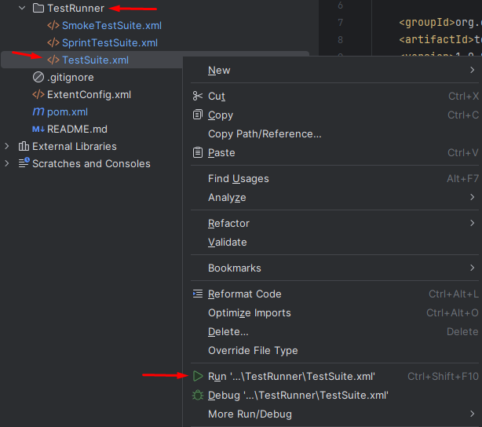

# Introduction
The UI-E2E-Testing repository provides a robust framework for automating end-to-end testing of the ITM Platform using Selenium WebDriver and Java.
The goal is to minimize manual testing efforts by automating various test scenarios, including smoke tests, functional tests, and regression tests for bug fixes.

# Getting Started
### 1. Software dependencies

- Java Development Kit (JDK): Version 17 or higher (download Java installer from here - [Link for Java Installer](https://www.oracle.com/in/java/technologies/downloads/))
- IntelliJ IDE community version (download IntelliJ community version from here - [Link for IntelliJ community edition](https://www.jetbrains.com/idea/download/?section=windows))

Make sure to install Java and set the path of the **Java bin folder** in the **path** system environment variable. Must have IntelliJ IDE to execute the tests.

The other dependencies come along with the project.

### 2. Installation

Clone the project using git clone command or download as zip. Open in IntelliJ and you are all set to proceed.

### 3. Build and Test

- Configure Java in the test automation framework from the Project Structure -> Project Settings -> Project settings tab following the below steps:
    - Access Project Structure from the settings icon in the top right corner.  
      
    - Set Java in the test automation framework from the Project Settings -> Project settings tab.    

- To build the project open the IDE terminal by **clicking ctrl twice** and run **mvn clean install** command. This would compile, test & package the project and install/copy the built .jar/.war file from the pom.xml file into your local maven repository.  

- To run the tests:  
The runner xml file under the TestRunner folder needs to be executed to run the test cases. The test case classes from **/src/test/javaTests/ folder** added in the runner file under the **classes** section would be executed.  
    - Way 1 - Use the **mvn test** command in the terminal from the bottom left corner as shown.    
      The runner xml file name configured inside the **pom.xml file** under the **plugins** will be executed by the **mvn test** command.  

    - Way 2 - Right-click any of runner xml files under the TestRunner folder and select Run to start the test execution as shown.    

To execute the test cases on local make sure to have the **EnvironmentVariables.properties** file under the **/src/test/java/Utils/** folder or create a new one. Add the configurations for the ITM environment to run the test cases for in the same file by copying them from the below files:
- **new environment:** /src/test/java/Utils/EnvironmentVariables.stage.properties
- **prod environment:** /src/test/java/Utils/EnvironmentVariables.prod.properties
- **demo environment:** /src/test/java/Utils/EnvironmentVariables.demo.properties

# API references
Refer to the following documentation for detailed API references:

- Selenium WebDriver: [Selenium Documentation](https://www.selenium.dev/documentation/)
- Maven: [Maven Documentation](https://maven.apache.org/guides/index.html)
- TestNG: [TestNG Documentation](https://testng.org/)
- REST Assured: [REST Assured Documentation](https://rest-assured.io/)

# Contribute

- Submit bugs and feature requests, and help us verify as they are checked in.
- Review source code changes.
